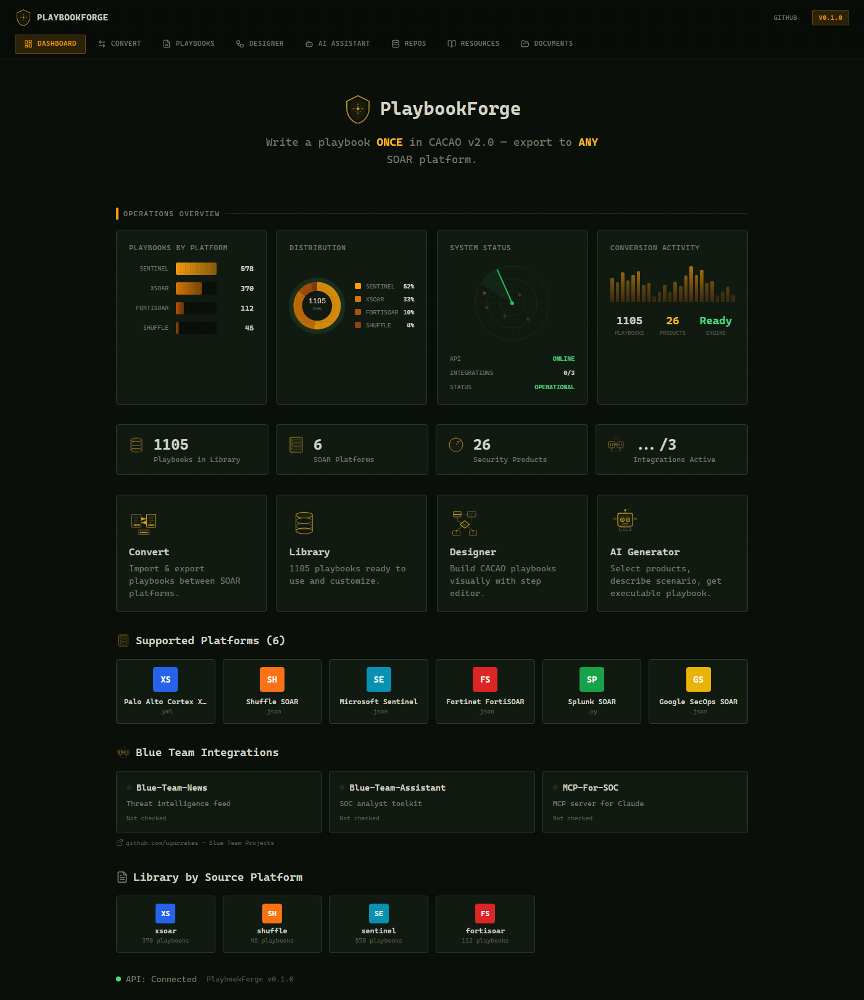

<p align="center">
  
</p>

<h1 align="center">PlaybookForge</h1>

<p align="center">
  <strong>Write a playbook ONCE in CACAO v2.0 — export to ANY SOAR platform.</strong>
</p>

<p align="center">
  <a href="#-supported-platforms"></a>
  <a href="#-getting-started"></a>
  <a href="#-getting-started"></a>
  <a href="LICENSE"></a>
  <a href="#-api-reference"></a>
</p>

---

## What is PlaybookForge?

PlaybookForge is a **universal SOAR playbook converter** that uses the [CACAO v2.0](https://docs.oasis-open.org/cacao/security-playbooks/v2.0/security-playbooks-v2.0.html) standard (OASIS, November 2023) as an intermediate representation to convert security automation playbooks between any supported SOAR platform.

**The problem:** Security teams using multiple SOAR platforms must manually rewrite playbooks for each one. A phishing investigation playbook written for Cortex XSOAR cannot run on Microsoft Sentinel or FortiSOAR without complete reconstruction.

**The solution:** PlaybookForge converts any vendor playbook into the vendor-neutral CACAO v2.0 format, then exports it to any target platform — automatically. Write once, deploy anywhere.

### Why PlaybookForge?

| Feature | CyberGuard | CACAO Roaster | **PlaybookForge** |
|---------|------------|---------------|-------------------|
| Vendor → CACAO import | LLM-only (3 vendors) | No | Deterministic + AI (6 platforms) |
| CACAO → Vendor export | No | No | **Yes** |
| Vendor → Vendor direct | No | No | **Yes** |
| Visual flow designer | No | Basic | React Flow |
| AI assistant | Academic | No | Practical (Ollama + Cloud) |
| Built-in playbook library | No | No | **1100+ playbooks** |
| Modern web UI | No | Yes | Tactical-themed |

---

## Supported Platforms

| Platform | Import | Export | Format |
|----------|--------|--------|--------|
| **Palo Alto Cortex XSOAR** | Yes | Yes | YAML |
| **Microsoft Sentinel** | Yes | Yes | ARM Template JSON |
| **Fortinet FortiSOAR** | Yes | Yes | Workflow JSON |
| **Shuffle SOAR** | Yes | Yes | JSON |
| **Splunk SOAR** | Yes | Yes | Python |
| **Google SecOps SOAR** | Yes | Yes | JSON |

---

## Features

### Playbook Conversion Engine
- **Bidirectional conversion** between all 6 SOAR platforms via CACAO v2.0 intermediate format
- **Auto-detection** of source platform format (upload any file, PlaybookForge identifies it)
- **Batch export** to all platforms simultaneously with single click
- **Validation engine** with 25+ rules checking CACAO v2.0 compliance

### Visual Playbook Designer
- **Drag-and-drop** workflow editor built on React Flow
- **Node types**: action, condition, parallel, playbook-action, start/end
- **Live preview** of CACAO JSON as you build
- **Import/export**: load existing CACAO playbooks for visual editing

### AI Playbook Generator
- **Natural language → CACAO**: describe a scenario, get a complete playbook
- **Multi-provider support**: Ollama (local), OpenAI, Anthropic
- **Product-aware**: select your security stack, AI generates platform-specific commands
- **26 security products** recognized across EDR, SIEM, SOAR, ticketing, and more

### Community Playbook Library
- **1100+ playbooks** auto-pulled from community repositories
- Browse by platform, search by keyword
- One-click convert any community playbook to your target platform

### Blue Team Integrations
- **Blue-Team-News** — live cybersecurity threat feed
- **Blue-Team-Assistant** — AI-powered security guidance
- **MCP-for-OIC** — Oracle Integration Cloud connector

### Operations Dashboard
- Real-time platform distribution charts
- System health monitoring with animated radar
- Conversion activity tracking
- Integration status overview

---

## Getting Started

### Prerequisites

- **Python 3.10+**
- **Node.js 18+**
- **pip** and **npm**

### Quick Start

```bash
# Clone the repository
git clone https://github.com/ugurcanates/playbookforge.git
cd playbookforge

# Backend setup
pip install -r playbookforge/requirements.txt
cd playbookforge
uvicorn backend.main:app --reload --host 127.0.0.1 --port 8000

# Frontend setup (new terminal)
cd playbookforge/frontend
npm install
npm run dev
```

Open [http://localhost:3000](http://localhost:3000) for the web UI, or [http://localhost:8000/docs](http://localhost:8000/docs) for the interactive API documentation.

### Docker

```bash
cd playbookforge
docker compose up backend frontend

# With AI support (Ollama)
docker compose --profile ai up
```

| Service | Port | Description |
|---------|------|-------------|
| `backend` | 8000 | FastAPI REST API |
| `frontend` | 3000 | Next.js web UI |
| `ollama` | 11434 | Local LLM (optional) |

---

## Architecture

```
                    ┌──────────────────────┐
                    │   Next.js Frontend   │
                    │      (Port 3000)     │
                    └──────────┬───────────┘
                               │ REST API
                    ┌──────────▼───────────┐
                    │   FastAPI Backend    │
                    │      (Port 8000)     │
                    ├──────────────────────┤
                    │                      │
               ┌────▼────┐          ┌─────▼─────┐
               │Importers│          │ Exporters  │
               │ Vendor→  │          │  →Vendor   │
               │ CACAO    │          │  formats   │
               └────┬────┘          └─────┬─────┘
                    │                     │
                    ▼                     ▼
            ┌──────────────────────────────┐
            │     CACAO v2.0 (OASIS)       │
            │  Intermediate Representation │
            └──────────────────────────────┘
```

### Tech Stack

| Layer | Technology |
|-------|-----------|
| Frontend | Next.js 14, React 18, TypeScript, Tailwind CSS |
| Flow Designer | @xyflow/react (React Flow) |
| Backend | Python 3.10+, FastAPI, Pydantic v2 |
| Standard | CACAO v2.0 (OASIS, November 2023) |
| AI | Ollama (local), OpenAI, Anthropic |
| Deployment | Docker Compose |

---

## API Reference

The backend exposes a RESTful API. Full interactive documentation is available at `/docs` (Swagger UI) when the server is running.

### Core Endpoints

| Method | Endpoint | Description |
|--------|----------|-------------|
| `POST` | `/validate` | Validate a CACAO playbook (25+ rules) |
| `POST` | `/convert/{platform_id}` | Convert CACAO to a specific vendor format |
| `POST` | `/convert/all` | Convert CACAO to all platforms at once |
| `POST` | `/import` | Import vendor playbook → CACAO |
| `GET` | `/platforms` | List all supported platforms |
| `GET` | `/products` | List recognized security products |
| `GET` | `/health` | API health check |

### AI Endpoints

| Method | Endpoint | Description |
|--------|----------|-------------|
| `POST` | `/ai/generate` | Natural language → CACAO playbook |
| `POST` | `/ai/enrich` | Enrich/improve existing playbook |
| `POST` | `/ai/analyze` | Quality analysis with suggestions |

### Library Endpoints

| Method | Endpoint | Description |
|--------|----------|-------------|
| `GET` | `/library/stats` | Playbook library statistics |
| `GET` | `/library/search` | Search community playbooks |
| `POST` | `/library/pull` | Pull from community repositories |

---

## Project Structure

```
playbookforge/
├── backend/
│   ├── main.py                    # FastAPI application entry point
│   ├── core/
│   │   ├── cacao_model.py         # CACAO v2.0 Pydantic models
│   │   ├── validator.py           # 25+ validation rules engine
│   │   └── builder.py             # Fluent playbook builder API
│   ├── exporters/
│   │   ├── base.py                # BaseExporter ABC
│   │   ├── xsoar_exporter.py      # → Cortex XSOAR (YAML)
│   │   ├── shuffle_exporter.py    # → Shuffle SOAR (JSON)
│   │   ├── sentinel_exporter.py   # → Microsoft Sentinel (ARM)
│   │   ├── fortisoar_exporter.py  # → FortiSOAR (JSON)
│   │   ├── splunk_soar_exporter.py    # → Splunk SOAR (Python)
│   │   └── google_secops_exporter.py  # → Google SecOps (JSON)
│   ├── importers/                 # Vendor → CACAO parsers
│   ├── llm/                       # AI/LLM integration layer
│   └── tests/                     # pytest test suite
├── frontend/
│   ├── src/app/                   # Next.js 14 App Router pages
│   ├── src/components/            # React components
│   └── src/lib/                   # API client & types
├── docker-compose.yml
└── requirements.txt
```

---

## Roadmap

### v1.1 — Quick Wins
- [ ] **Batch Convert** — Convert multiple playbooks in a single operation
- [ ] **Playbook Diff/Compare** — Side-by-side comparison of two playbooks
- [ ] **Playbook Templates** — Pre-built templates for common scenarios (Phishing Response, Malware Containment, Incident Triage)
- [ ] **PDF/DOCX Export** — Generate playbook documentation for compliance and reporting

### v1.2 — Intelligence & Testing
- [ ] **MITRE ATT&CK Mapping** — Auto-map playbook steps to ATT&CK techniques and tactics
- [ ] **Playbook Simulator** — Dry-run playbooks before deployment with step-by-step trace
- [ ] **Validation Engine v2** — Deeper CACAO v2.0 compliance checks with auto-fix suggestions
- [ ] **Advanced Analytics** — Conversion statistics, error trends, platform coverage reports

### v1.3 — AI & Automation
- [ ] **AI Playbook Optimizer** — Analyze and improve existing playbooks using LLM
- [ ] **Webhook Integration** — Event-driven automation triggers for playbook conversion
- [ ] **Plugin System** — Modular architecture for third-party extensions
- [ ] **CI/CD Pipeline Integration** — GitHub Actions / GitLab CI workflows for automated playbook deployment

### v2.0 — Enterprise
- [ ] **Real-time Collaboration** — Multi-user concurrent playbook editing with conflict resolution
- [ ] **Community Marketplace** — Publish, discover, and rate community playbooks
- [ ] **Role-Based Access Control (RBAC)** — Team management with granular permissions
- [ ] **Audit Logging** — Complete operation history with compliance-ready exports
- [ ] **Multi-tenant SaaS** — Cloud-hosted version with organization isolation

---

## Contributing

Contributions are welcome! Please follow these steps:

1. Fork the repository
2. Create a feature branch (`git checkout -b feat/amazing-feature`)
3. Commit your changes using [Conventional Commits](https://www.conventionalcommits.org/) (`feat:`, `fix:`, `docs:`, `test:`)
4. Push to the branch (`git push origin feat/amazing-feature`)
5. Open a Pull Request

### Development Setup

```bash
# Backend (with auto-reload)
cd playbookforge
uvicorn backend.main:app --reload --port 8000

# Frontend (with hot-reload)
cd playbookforge/frontend
npm run dev

# Run tests
cd playbookforge
pytest -v
```

---

## License

This project is licensed under the **Apache License 2.0** — see the [LICENSE](LICENSE) file for details.

---

## Author

**Ugur Ates** — [playbookforge.io](https://playbookforge.io)

---

<p align="center">
  <sub>Built with CACAO v2.0 (OASIS Standard) | Powered by FastAPI + Next.js</sub>
</p>
