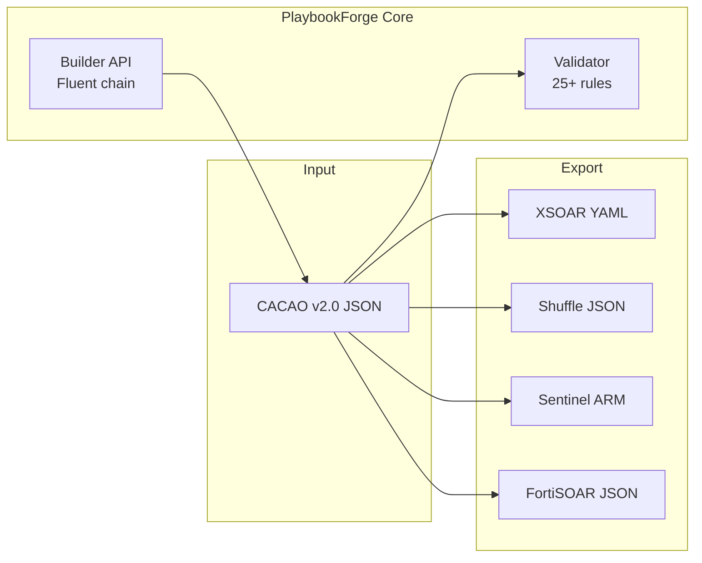
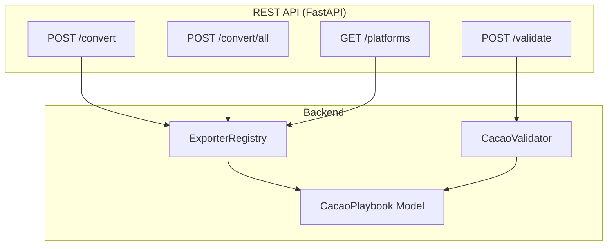

<p align="center">
  <h1 align="center">PlaybookForge</h1>
  <p align="center">
    <strong>Universal SOAR Playbook Converter</strong><br>
    Write a playbook ONCE in CACAO v2.0 &mdash; export to ANY SOAR platform.
  </p>
  <p align="center">
    <a href="https://www.python.org/downloads/"></a>
    <a href="LICENSE"></a>
    <a href="https://github.com/your-org/playbookforge/actions"></a>
  </p>
</p>

---

## What is PlaybookForge?

PlaybookForge converts security playbooks between SOAR platforms using **CACAO v2.0** (OASIS standard) as an intermediate format. No other tool does **CACAO-to-Vendor export** &mdash; this is our unique differentiator.

### Key Features

| Feature | Description |
|---------|-------------|
| **CACAO v2.0 Native** | Full Pydantic models for the OASIS CACAO Security Playbooks v2.0 standard |
| **Multi-Platform Export** | One playbook, four vendor formats (and growing) |
| **Validation Engine** | 25+ validation rules with errors, warnings, and quality checks |
| **Builder API** | Fluent Python API for building playbooks programmatically |
| **REST API** | FastAPI backend with Swagger docs at `/docs` |
| **Docker Ready** | One command to spin up the entire stack |

### Supported Platforms

| Platform | Direction | Format |
|----------|-----------|--------|
| **Palo Alto Cortex XSOAR** | Export | YAML |
| **Shuffle SOAR** | Export | JSON |
| **Microsoft Sentinel** | Export | ARM Template JSON |
| **Fortinet FortiSOAR** | Export | JSON |
| Splunk SOAR | Planned | Python |
| Google SecOps SOAR | Planned | Python/JSON |

---

## Quick Start

### Option 1: Docker

```bash
docker compose up backend
# API available at http://localhost:8000/docs
```

### Option 2: Manual

```bash
pip install -r requirements.txt
python demo.py                         # Run the full pipeline demo
uvicorn backend.main:app --reload      # Start API server at localhost:8000
```

### Run Tests

```bash
pytest backend/tests/ -v
```

---

## Architecture





---

## API Reference

Start the server and visit `http://localhost:8000/docs` for interactive Swagger UI.

| Method | Endpoint | Description |
|--------|----------|-------------|
| `GET` | `/health` | Health check |
| `GET` | `/platforms` | List supported platforms |
| `POST` | `/validate` | Validate a CACAO playbook |
| `POST` | `/convert` | Convert to a specific platform |
| `POST` | `/convert/all` | Convert to all platforms at once |
| `POST` | `/convert/download/{platform_id}` | Convert and download as file |
| `POST` | `/playbook/summary` | Get playbook summary |

### Example: Convert a Playbook

```bash
curl -X POST http://localhost:8000/convert \
  -H "Content-Type: application/json" \
  -d '{
    "playbook": { ... },
    "target_platform": "xsoar"
  }'
```

---

## Builder API

Build CACAO playbooks programmatically with the fluent builder:

```python
from backend.core.builder import PlaybookBuilder
from backend.core.cacao_model import Command, CommandType, PlaybookType

playbook = (
    PlaybookBuilder("Phishing Response")
    .set_description("Investigate phishing emails")
    .add_type(PlaybookType.INVESTIGATION)
    .add_label("phishing")
    .add_mitre_reference("T1566.001", "Spearphishing Attachment")
    .add_variable("email_id", var_type="string", external=True)
    .add_action_step(
        name="Extract IOCs",
        description="Parse email and extract indicators",
        commands=[Command(type=CommandType.HTTP_API, command="POST /api/ioc/extract")],
    )
    .add_if_condition(
        name="Is Malicious?",
        condition="$$verdict$$ == 'malicious'",
        on_true_name="Block Sender",
    )
    .add_action_step(
        name="Block Sender",
        commands=[Command(type=CommandType.HTTP_API, command="POST /api/blocklist")],
    )
    .build()
)
```

---

## Project Structure

```
playbookforge/
├── backend/
│   ├── main.py                            # FastAPI application
│   ├── core/
│   │   ├── cacao_model.py                 # CACAO v2.0 Pydantic models
│   │   ├── validator.py                   # 25+ validation rules
│   │   └── builder.py                     # Fluent builder API
│   ├── exporters/
│   │   ├── base.py                        # BaseExporter ABC
│   │   ├── xsoar_exporter.py              # Cortex XSOAR export
│   │   ├── shuffle_exporter.py            # Shuffle SOAR export
│   │   └── sentinel_fortisoar_exporter.py # Sentinel + FortiSOAR export
│   └── tests/                             # 131 tests
├── demo.py                                # Full pipeline demo
├── docker-compose.yml                     # Docker orchestration
└── requirements.txt                       # Python dependencies
```

---

## Comparison with Alternatives

| Feature | CyberGuard | CACAO Roaster | **PlaybookForge** |
|---------|-----------|---------------|-------------------|
| Vendor to CACAO | LLM-based (3 vendors) | No | Deterministic + LLM (6+ vendors) |
| **CACAO to Vendor** | No | No | **Yes** |
| **Vendor to Vendor** | No | No | **Yes** |
| Visual Editor | No | Basic | Planned (React Flow) |
| AI Assistant | Academic | No | Planned (Ollama + Cloud) |
| Docker Deploy | No | Yes | Yes |
| Splunk SOAR | No | No | Planned |
| Google SecOps | No | No | Planned |

---

## Roadmap

- [x] **Phase 1** &mdash; Core backend, 4 exporters, validation, builder API, tests, Docker
- [ ] **Phase 2** &mdash; Importers (Vendor to CACAO reverse conversion)
- [ ] **Phase 3** &mdash; Additional exporters (Splunk SOAR, Google SecOps, TheHive)
- [ ] **Phase 4** &mdash; React frontend (Next.js + Tailwind + shadcn/ui)
- [ ] **Phase 5** &mdash; Visual flow designer (React Flow)
- [ ] **Phase 6** &mdash; LLM integration (natural language to playbook)

---

## Contributing

Contributions are welcome! Please:

1. Fork the repository
2. Create a feature branch (`git checkout -b feat/my-feature`)
3. Write tests for your changes
4. Ensure all tests pass (`pytest backend/tests/ -v`)
5. Use conventional commits (`feat:`, `fix:`, `docs:`, `test:`, `refactor:`)
6. Open a pull request

---

## License

[Apache License 2.0](LICENSE) &mdash; Ugur Ates
